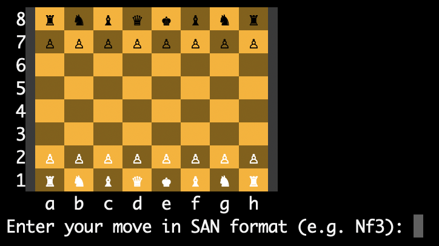

<h1 style="display: inline;">
  Silkfish
  
</h1>

<div align="center">

  


</div>

---

**2024.9.7:** silkfish is now a Lichess Bot &#129302; on lichess.org! View its [profile](https://lichess.org/@/silkfish).

TODOs
- [ ] Null move pruning.
- [ ] Transposition table.  
    
## 1. Compile the Engine
***silkfish*** engine is written in c++, so you do need a ```g++``` compiler to compile it. 

To compile, run the following command at the current directory,

    make

This should give you an executable ```silkfish``` at the current directory, being the engine itself &#x270C;

## 2. To Play with GUI (Python3 needed)
You can interact with ***silkfish*** engine with a commandline GUI written in Python3. However, you do need to install some libraries first, run the following command at the current directory **if you use pip3 to install Python3 libraries**,

    pip3 install -r gui_requirements.txt

If you haven't compiled the engine, you need to compile it following the "Compile the Engine" section!!

Now, with the compiled engine (```silkfish``` executable) and the installed Python3 libraries, you can run the following command at the current directory to enjoy interacting with the engine! &#x1F37A;

    python3 gui.py

This is how the command line GUI looks like:



## 3. Use the Engine
**After compilation**, you can use the engine without a GUI, you should execute the engine in the following format.

    ./silkfish <flag1> <option1> <flag2> <option2> ... <-fen> {fen_string}

There're three main ways of using the engine. 

1. You pass in a ```-demo``` flag to make the engine play a full game with itself.
2. You don't pass the ```-demo``` flag, so the engine will expect you to pass a ```-fen``` flag followed by a ```fen_string``` **at the very end of your command**, and the engine will output the evaluation for this FEN position, as well as the best move.
3. You pass **No argument at all**, this will give you an UCI engine!

Following are some examples of using the engine, with explanations,

    ./silkfish -demo                                                # This will start a full game played by engine with itself, using all default parameters.

    ./silkfish -md 5 -demo 43 -m                                 # This will start a full game played by engine with itself, using minimax_depth=5, with output muted for each move.

    ./silkfish -qd 3 -md 5 -fen 4k3/8/6K1/8/3Q4/8/8/8 w - - 0 1     # This will make the engine evaluate the position, output a evaluation and a best move.

    ./silkfish -md 5 -qd 3 -fen 4k3/8/6K1/8/3Q4/8/8/8 w - - 0 1     # This will make the engine evaluate the position, output a evaluation and a best move.

    ./silkfish                                                      # This will run the engine in UCI mode

### 3.1 Flags
Flags are passed with options following them (if there should be an option). The order of the flags doesn't matter, expect that ```-fen``` flag and the ```fen_string``` needs to be put **at the very end of the command**.

1. ```-m```: mute the output of engine (expect the final results).
2. ```-md```: followed by an int ```depth```, being the depth of the minimax search.
3. ```-qd```: followed by an int ```depth```, being the depth of the quiescence search.
4. ```-demo```: demo mode, the engine will play a full game with itself.
5. ```-fen```: followed by a string of FEN, **it should by placed at the very end!** used when ```-demo``` flag is NOT set. 

## 4. Testing

### 4.1 Eigenmann Rapid Engine Test
This is a test containing 111 positions, each position is expected to be solved in 15 seconds. Run it with 

    python3 test_eret.py

Below is a result table of ```silkfish``` on the ERET test.

| Commit Hash   | Position Passed (out of 111)   | Pass Rate   | Date |
|------------|------------|------------|------------|
| 93f488c | 13 (without time limit)| 11.71% | 2024.9.6 |
| aa7f91f | 11 | 9.91% | 2024.9.7 |
| 0c1a8a5 | 15 (without time limit)| 13.51% | 2024.9.15 |
